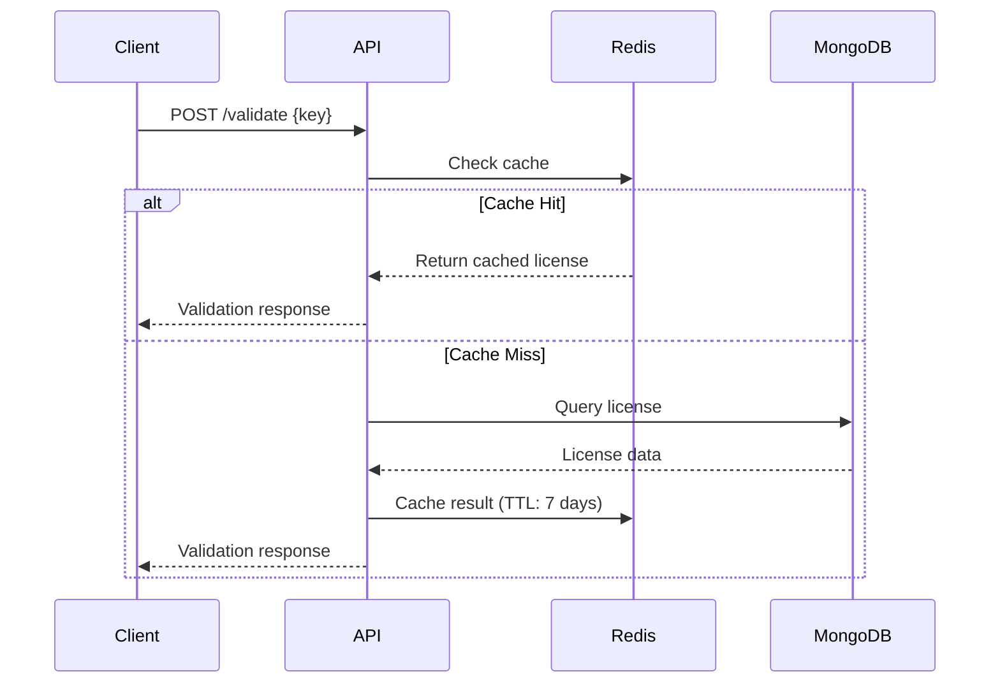

## System Architecture

KeyBox is a distributed license management system built on a three-tier architecture:

<Steps>
  <Step title="API Layer">
    Express.js REST API handling license operations, validation, and activation
  </Step>
  <Step title="Cache Layer">
    Redis-based caching system for high-performance license validation
  </Step>
  <Step title="Database Layer">
    MongoDB storing persistent license data and relationships
  </Step>
</Steps>

## API Request Flow

When a client validates a license, KeyBox follows this request flow:



### Validation Endpoint

The validation controller implements a two-tier lookup strategy:

```typescript ~/workspace/source/apps/server/src/controllers/redisLicense.controller.ts
export const validateLicense = async (req: Request, res: Response) => {
  const { key } = req.body;
  const currentMachineId = machineIdSync(true);
  
  // 1. Try Redis first
  const cached = await getCachedLicense(key);
  if (cached) {
    console.log("REDIS HIT for license:", key);
    // Validate and return cached data
  }
  
  // 2. MongoDB fallback
  console.log("MONGO HIT for license:", key);
  const license = await License.findOne({ key });
  // Validate and cache result
}
```

<Info>
  Redis cache hits serve validation requests in **sub-millisecond** time, significantly reducing database load.
</Info>

## Validation Process

KeyBox performs comprehensive validation checks in this order:

<Accordion title="1. License Existence">
  Verifies the license key exists in the database.
  
  ```json
  {
    "valid": false,
    "status": "invalid",
    "message": "Key does not exist"
  }
  ```
</Accordion>

<Accordion title="2. Machine ID Verification">
  Checks if the license is bound to the correct machine (if activated).
  
  ```typescript
  if (license.machineId && license.machineId !== currentMachineId) {
    return res.json({
      valid: false,
      status: "machine_mismatch",
      message: "License is not valid for this machine"
    });
  }
  ```
</Accordion>

<Accordion title="3. Status Verification">
  Checks the current license status:
  - **PENDING**: License created but not yet activated
  - **ACTIVE**: License is valid and active
  - **EXPIRED**: License has passed expiration date
  - **REVOKED**: License manually revoked by developer
</Accordion>

<Accordion title="4. Expiration Check">
  For active licenses, validates the current date against `expiresAt`.
  
  ```typescript
  if (now > license.expiresAt) {
    license.status = Status.EXPIRED;
    await license.save();
    await invalidateCachedLicense(key);
  }
  ```
</Accordion>

## Caching Strategy

KeyBox uses Redis for intelligent license caching:

### Cache Configuration

```typescript ~/workspace/source/apps/server/src/cache/license.cache.ts
const TTL_SECONDS = 604800; // 1 week

export interface CachedLicense {
  status: Status;
  message?: string;
  expiresAt?: number;
  duration?: string;
  machineId?: string;
}
```

### Cache Operations

<Steps>
  <Step title="Write-Through Caching">
    When MongoDB is queried, results are immediately cached to Redis with a 7-day TTL
  </Step>
  <Step title="Cache Invalidation">
    Cache is invalidated when license state changes (activation, revocation, expiration)
    
    ```typescript
    await invalidateCachedLicense(key);
    ```
  </Step>
  <Step title="Graceful Degradation">
    If Redis is unavailable, the system falls back to MongoDB without errors
    
    ```typescript
    catch (error) {
      console.error("Redis error:", error);
      return null; // Continue without cache
    }
    ```
  </Step>
</Steps>

<Warning>
  Cache entries include `machineId` to prevent unauthorized license transfers between machines.
</Warning>

## License Creation Flow

When a new license is created:

```typescript ~/workspace/source/apps/server/src/controllers/license.controller.ts
export const createLicense = async (req: AuthRequest, res: Response) => {
  const { duration, clientId, projectId, services } = req.body;
  
  const issuedAt = new Date();
  const expiresAt = new Date();
  expiresAt.setMonth(issuedAt.getMonth() + duration);
  
  const key = generateKey(projectId);
  
  const license = await License.create({
    key,
    duration,
    issuedAt,
    expiresAt,
    status: Status.PENDING, // Starts as PENDING
    services: services || ["Hosting"],
    user: req.userId,
    client: clientId,
    project: projectId,
  });
}
```

<Note>
  New licenses start with `PENDING` status and transition to `ACTIVE` only upon first activation.
</Note>

## Automated License Expiration

KeyBox includes a cron job for automatic license expiration:

```typescript ~/workspace/source/apps/server/src/api/cron/expired-licenses.ts
export default async function handler(req: VercelRequest, res: VercelResponse) {
  const now = new Date();
  
  // Find licenses that should expire
  const expiredLicenses = await License.find({
    expiresAt: { $lt: now },
    status: Status.ACTIVE,
  }).select("key");
  
  // Update database
  await License.updateMany(
    { key: { $in: expiredLicenses.map((l) => l.key) } },
    { $set: { status: Status.EXPIRED } }
  );
  
  // Invalidate Redis cache
  for (const license of expiredLicenses) {
    await invalidateCachedLicense(license.key);
  }
}
```

<Info>
  The cron job runs on Vercel's infrastructure and is protected by the `x-vercel-cron` header to prevent unauthorized execution.
</Info>

## Performance Characteristics

| Operation | With Redis | Without Redis |
|-----------|------------|---------------|
| License Validation | < 1ms | 50-100ms |
| Cache Hit Rate | ~95% | 0% |
| Database Load | 5% of requests | 100% of requests |

<Tip>
  For production deployments, Redis caching is **strongly recommended** to handle high-volume validation requests.
</Tip>

## Security Considerations

- All API endpoints require authentication via JWT middleware
- Machine IDs are hashed using SHA-256 for privacy
- License keys are unique and indexed for fast lookups
- Rate limiting prevents brute-force validation attempts
- Cron endpoints are protected by Vercel's authentication headers

## Next Steps

<CardGroup cols={2}>
  <Card title="License Lifecycle" icon="arrows-rotate" href="/concepts/license-lifecycle">
    Learn about license states and transitions
  </Card>
  <Card title="Machine Binding" icon="desktop" href="/concepts/machine-binding">
    Understand device-level license enforcement
  </Card>
</CardGroup>