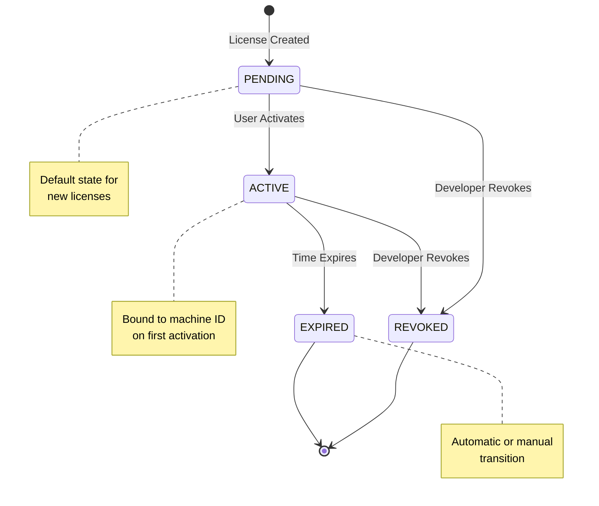

## License States

Every license in KeyBox progresses through a defined lifecycle with four possible states:

```typescript ~/workspace/source/apps/server/src/models/License.ts
export enum Status {
  PENDING = "PENDING",
  ACTIVE = "ACTIVE",
  EXPIRED = "EXPIRED",
  REVOKED = "REVOKED",
}
```

### State Descriptions

<CardGroup cols={2}>
  <Card title="PENDING" icon="clock" color="#FFB020">
    License created but not yet activated by the end user
  </Card>
  <Card title="ACTIVE" icon="circle-check" color="#16A34A">
    License activated and currently valid
  </Card>
  <Card title="EXPIRED" icon="calendar-xmark" color="#DC2626">
    License has passed its expiration date
  </Card>
  <Card title="REVOKED" icon="ban" color="#7C3AED">
    License manually revoked by the developer
  </Card>
</CardGroup>

## State Transition Diagram



## PENDING State

When a license is first created, it starts in the `PENDING` state.

### Characteristics

- License key is generated and stored in database
- Expiration date is calculated but not yet enforced
- No machine binding exists
- License cannot be validated until activated

### Creation Code

```typescript ~/workspace/source/apps/server/src/controllers/license.controller.ts
const license = await License.create({
  key,
  duration,
  issuedAt,
  expiresAt,
  status: Status.PENDING, // Default state
  services: services || ["Hosting"],
  user: req.userId,
  client: clientId,
  project: projectId,
});
```

### Validation Response

```json
{
  "valid": false,
  "status": "pending",
  "message": "License has not been activated yet"
}
```

<Info>
  Users receive the license key immediately but must activate it through your application or the SDK.
</Info>

## ACTIVE State

A license transitions to `ACTIVE` when the end user activates it for the first time.

### Activation Process

<Steps>
  <Step title="User Initiates Activation">
    Application calls the activation endpoint with the license key
  </Step>
  <Step title="Machine ID Captured">
    System generates a unique, hashed machine identifier
  </Step>
  <Step title="License Bound">
    License is bound to the machine and status changes to ACTIVE
  </Step>
  <Step title="Expiration Timer Starts">
    The expiration countdown begins from activation time
  </Step>
</Steps>

### Activation Code

```typescript ~/workspace/source/apps/server/src/controllers/redisLicense.controller.ts
export const activateLicense = async (req: Request, res: Response) => {
  const { key } = req.body;
  const machineId = machineIdSync(true);
  
  const license = await License.findOne({ key });
  
  if (license.status === Status.PENDING) {
    // First-time activation
    const issuedAt = new Date();
    const expiresAt = new Date();
    expiresAt.setMonth(expiresAt.getMonth() + license.duration);
    
    license.status = Status.ACTIVE;
    license.issuedAt = issuedAt;
    license.expiresAt = expiresAt;
    license.machineId = machineId; // Bind to this machine
    
    await license.save();
    await invalidateCachedLicense(key);
  }
}
```

### Validation Response

```json
{
  "valid": true,
  "status": "active",
  "duration": "6 months",
  "expiresAt": 1735689600000
}
```

<Warning>
  Once activated, a license is **permanently bound** to the machine ID. It cannot be transferred to another machine without developer intervention.
</Warning>

## EXPIRED State

Licenses automatically transition to `EXPIRED` when the current date exceeds `expiresAt`.

### Expiration Methods

<Accordion title="Automatic Expiration (Cron Job)">
  A scheduled cron job runs periodically to mark expired licenses:
  
  ```typescript ~/workspace/source/apps/server/src/api/cron/expired-licenses.ts
  const expiredLicenses = await License.find({
    expiresAt: { $lt: now },
    status: Status.ACTIVE,
  });
  
  await License.updateMany(
    { key: { $in: expiredLicenses.map((l) => l.key) } },
    { $set: { status: Status.EXPIRED } }
  );
  
  // Invalidate cache for each expired license
  for (const license of expiredLicenses) {
    await invalidateCachedLicense(license.key);
  }
  ```
  
  <Info>
    The cron job ensures licenses are marked as expired even if they're not being actively validated.
  </Info>
</Accordion>

<Accordion title="Runtime Expiration Check">
  Licenses are also checked during validation:
  
  ```typescript
  if (license.status === Status.ACTIVE) {
    const now = new Date();
    if (now > license.expiresAt) {
      license.status = Status.EXPIRED;
      await license.save();
      return res.json({
        valid: false,
        status: "expired",
        message: "License has expired",
        expiresAt: license.expiresAt,
      });
    }
  }
  ```
  
  <Note>
    This provides real-time expiration enforcement without waiting for the cron job.
  </Note>
</Accordion>

### Validation Response

```json
{
  "valid": false,
  "status": "expired",
  "message": "License has expired",
  "expiresAt": 1735689600000
}
```

### Expired License Behavior

- License key remains in database for record-keeping
- Cannot be reactivated (new license required)
- Machine binding is preserved
- All validation requests return `valid: false`

## REVOKED State

Developers can manually revoke licenses at any time, regardless of current state.

### Revocation Use Cases

- Suspected license abuse or sharing
- Refund issued to customer
- Policy violation by licensee
- Emergency license termination

### Toggle Implementation

```typescript ~/workspace/source/apps/server/src/controllers/license.controller.ts
export const toggleLicense = async (req: Request, res: Response) => {
  const key = req.params.key;
  const license = await License.findOne({ key });
  
  license.status = 
    license.status === Status.ACTIVE 
      ? Status.REVOKED 
      : Status.ACTIVE;
  
  await license.save();
  
  // Invalidate cache because state CHANGED
  await invalidateCachedLicense(key);
  
  return res.json({
    message: `License status changed to ${license.status}`,
    key: license.key,
    status: license.status,
  });
}
```

<Warning>
  Revoking a license immediately invalidates all active sessions. Applications using the SDK will shut down on the next validation check.
</Warning>

### Validation Response

```json
{
  "valid": false,
  "status": "revoked",
  "message": "License revoked by developer"
}
```

### SDK Behavior on Revocation

Applications using the Node.js SDK will automatically shut down:

```javascript ~/workspace/source/apps/SDK/Node-SDK/index.js
const terminalStatuses = ["revoked", "expired", "invalid"];

if (isTerminal && lastState !== "invalid") {
  lastState = "invalid";
  log("ERROR", `License ${statusLower.toUpperCase()} — shutting down", data);
  onRevoke?.(data);
  return;
}
```

## State Comparison Table

| State | Valid | Can Activate | Machine Bound | Reversible |
|-------|-------|--------------|---------------|------------|
| PENDING | No | Yes | No | Yes (to REVOKED) |
| ACTIVE | Yes | N/A | Yes | Yes (to REVOKED/EXPIRED) |
| EXPIRED | No | No | Yes | No |
| REVOKED | No | No | Preserved | Yes (toggle back) |

## Cache Invalidation Strategy

State changes trigger cache invalidation to ensure consistency:

```typescript
// Always invalidate cache on state transitions
await invalidateCachedLicense(key);
```

### When Cache is Invalidated

- License activation (PENDING → ACTIVE)
- License revocation (ACTIVE/PENDING → REVOKED)
- License expiration (ACTIVE → EXPIRED)
- Toggle operations (ACTIVE ↔ REVOKED)

<Tip>
  Cache invalidation ensures validation requests always receive the latest license state within milliseconds.
</Tip>

## Best Practices

<CardGroup cols={2}>
  <Card title="Monitor Pending Licenses" icon="magnifying-glass">
    Track licenses that remain PENDING for extended periods—they may indicate delivery issues
  </Card>
  <Card title="Automate Expiration" icon="robot">
    Rely on the cron job for consistent expiration enforcement
  </Card>
  <Card title="Use Revocation Sparingly" icon="triangle-exclamation">
    Revocation immediately impacts users—consider communication before action
  </Card>
  <Card title="Preserve Expired Records" icon="database">
    Don't delete expired licenses—they provide valuable audit history
  </Card>
</CardGroup>

## Next Steps

<CardGroup cols={2}>
  <Card title="Machine Binding" icon="desktop" href="/concepts/machine-binding">
    Learn how licenses are bound to specific devices
  </Card>
  <Card title="API Reference" icon="code" href="/api-reference/licenses/validate">
    Explore the validation and activation endpoints
  </Card>
</CardGroup>