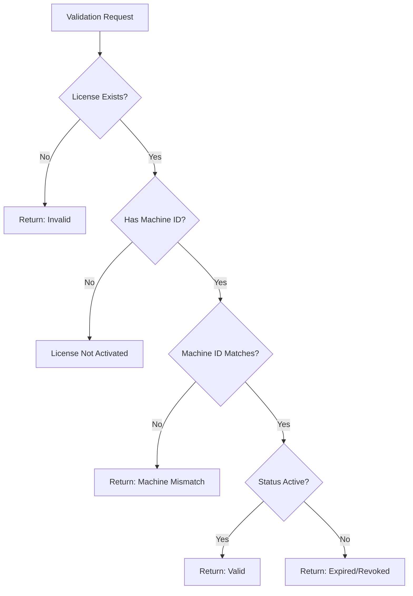

## What is Machine Binding?

Machine binding is KeyBox's mechanism for enforcing **single-device license activation**. When a user activates a license, it becomes permanently associated with that specific machine's unique identifier.

<Note>
  This prevents license sharing and ensures each license is used on only one device at a time.
</Note>

## How Machine IDs Work

KeyBox uses the `node-machine-id` library to generate stable, unique identifiers for each machine.

### Machine ID Generation

```typescript ~/workspace/source/apps/server/src/controllers/redisLicense.controller.ts
import { machineIdSync } from "node-machine-id";

// Generate stable, hashed machine ID
const machineId = machineIdSync(true);
```

### Machine ID Characteristics

<CardGroup cols={2}>
  <Card title="Stable" icon="anchor">
    Same ID across application restarts and system reboots
  </Card>
  <Card title="Unique" icon="fingerprint">
    Different for each physical/virtual machine
  </Card>
  <Card title="Hashed" icon="shield">
    SHA-256 hashed for privacy and security
  </Card>
  <Card title="Hardware-Based" icon="microchip">
    Derived from hardware identifiers (CPU, MAC, etc.)
  </Card>
</CardGroup>

### What Machine IDs Include

The library generates IDs based on:

- CPU serial number
- System UUID
- MAC address
- Motherboard serial number

<Info>
  The exact components vary by operating system. The `machineIdSync(true)` parameter ensures the ID is hashed for privacy.
</Info>

## License Binding Process

Machine binding occurs during **first activation**:

<Steps>
  <Step title="User Receives License Key">
    Developer generates a license in PENDING state with no machine binding
  </Step>
  <Step title="User Activates License">
    Application calls `/validate/activate` endpoint with the license key
  </Step>
  <Step title="Machine ID Captured">
    Server generates the machine ID for the requesting device
  </Step>
  <Step title="License Bound">
    Machine ID is stored in the license record permanently
    
    ```typescript
    license.status = Status.ACTIVE;
    license.machineId = machineId; // Permanent binding
    await license.save();
    ```
  </Step>
</Steps>

### Activation Code with Binding

```typescript ~/workspace/source/apps/server/src/controllers/redisLicense.controller.ts
export const activateLicense = async (req: Request, res: Response) => {
  const { key } = req.body;
  const machineId = machineIdSync(true); // Get current machine ID
  
  const license = await License.findOne({ key });
  
  // Check if already activated on different machine
  if (license.status === Status.ACTIVE) {
    if (license.machineId !== machineId) {
      return res.status(403).json({
        success: false,
        message: "License already activated on another machine",
      });
    }
    
    return res.json({
      success: true,
      message: "License already activated on this machine",
    });
  }
  
  // First-time activation - bind to this machine
  license.status = Status.ACTIVE;
  license.machineId = machineId;
  await license.save();
}
```

<Warning>
  Once a license is activated, the machine binding is **permanent** and cannot be changed without developer intervention.
</Warning>

## Machine ID Validation

Every license validation request checks the machine ID:

```typescript ~/workspace/source/apps/server/src/controllers/redisLicense.controller.ts
export const validateLicense = async (req: Request, res: Response) => {
  const { key } = req.body;
  const currentMachineId = machineIdSync(true);
  
  const license = await License.findOne({ key });
  
  // Machine mismatch check
  if (
    license.status === Status.ACTIVE &&
    license.machineId &&
    license.machineId !== currentMachineId
  ) {
    return res.json({
      valid: false,
      status: "machine_mismatch",
      message: "License is not valid for this machine",
    });
  }
}
```

### Validation Flow



### Machine Mismatch Response

```json
{
  "valid": false,
  "status": "machine_mismatch",
  "message": "License is not valid for this machine"
}
```

## Data Model

Machine ID storage in the license schema:

```typescript ~/workspace/source/apps/server/src/models/License.ts
const licenseSchema = new Schema<LicenseType>({
  key: {
    type: String,
    unique: true,
    required: true,
  },
  // ... other fields ...
  machineId: {
    type: String,
    default: null,    // Null until activation
    index: true,      // Indexed for fast lookups
  },
});

export interface LicenseType {
  key: string;
  duration: number;
  issuedAt: Date;
  expiresAt: Date;
  status: Status;
  services: Services[];
  machineId: string;  // Bound machine identifier
  user: mongoose.Types.ObjectId;
  client: mongoose.Types.ObjectId;
  project: mongoose.Types.ObjectId;
}
```

<Info>
  The `machineId` field is indexed to enable fast machine-based license lookups and queries.
</Info>

## Caching Machine IDs

Machine IDs are included in cached license data:

```typescript ~/workspace/source/apps/server/src/cache/license.cache.ts
export interface CachedLicense {
  status: Status;
  message?: string;
  expiresAt?: number;
  duration?: string;
  machineId?: string; // Cached for fast validation
}

// When caching an active license
await setCachedLicense(key, {
  status: Status.ACTIVE,
  expiresAt: license.expiresAt.getTime(),
  duration: `${license.duration} months`,
  machineId: license.machineId, // Include in cache
});
```

### Cache Validation

Redis cache hits also enforce machine binding:

```typescript
const cached = await getCachedLicense(key);
if (cached) {
  // Check machine mismatch from cache
  if (
    cached.status === Status.ACTIVE &&
    cached.machineId &&
    cached.machineId !== currentMachineId
  ) {
    return res.json({
      valid: false,
      status: "machine_mismatch",
      message: "License is not valid for this machine",
    });
  }
}
```

<Tip>
  Caching machine IDs allows KeyBox to enforce device restrictions without database queries, maintaining sub-millisecond validation times.
</Tip>

## Security Implications

### Benefits

<Accordion title="Prevents License Sharing">
  Users cannot share license keys with others, as each key only works on one machine.
</Accordion>

<Accordion title="Enforces Licensing Terms">
  Ensures compliance with single-device licensing agreements automatically.
</Accordion>

<Accordion title="Protects Revenue">
  Prevents unauthorized distribution and use of licenses across multiple devices.
</Accordion>

<Accordion title="Audit Trail">
  Machine IDs provide a record of which device activated each license for support and security purposes.
</Accordion>

### Privacy Considerations

<Warning>
  Machine IDs are **hashed** using SHA-256 before storage. Raw hardware identifiers are never stored or transmitted.
</Warning>

- Hashed IDs cannot be reverse-engineered to reveal hardware details
- No personally identifiable information (PII) is included
- Machine IDs are only used for validation—not tracking or analytics

## SDK Machine Binding

The Node.js SDK automatically handles machine binding:

```javascript ~/workspace/source/apps/SDK/Node-SDK/index.js
export async function activateLicense({
  productName,
  key,
  apiUrl = "https://api-keybox.vercel.app",
  endpoint = "/validate/activate",
}) {
  // SDK sends license key to activation endpoint
  // Server automatically captures and binds machine ID
  const res = await fetch(`${apiUrl}${endpoint}`, {
    method: "POST",
    headers: { "Content-Type": "application/json" },
    body: JSON.stringify({ key, productName }),
  });
  
  const data = await res.json();
  
  if (!res.ok || data?.success === false) {
    throw new Error(data?.message || "License activation failed");
  }
  
  return data; // Includes machineId in response
}
```

<Info>
  SDK users don't need to manually handle machine IDs—the activation process is automatic and transparent.
</Info>

## Handling Edge Cases

### Hardware Changes

Machine IDs can change when:

- Motherboard is replaced
- CPU is upgraded
- Virtual machine is migrated
- MAC address changes

<Note>
  In these scenarios, users will receive a `machine_mismatch` error. Developers must manually reset the license's machine binding.
</Note>

### Virtual Machines

Virtual machines have stable machine IDs as long as:

- VM configuration remains unchanged
- VM is not cloned or duplicated
- Hypervisor provides consistent hardware identifiers

<Warning>
  Cloning VMs will generate different machine IDs. Each clone requires a separate license.
</Warning>

### Development vs Production

For development/testing scenarios:

```typescript
// Option: Create licenses without machine binding
const devLicense = await License.create({
  // ... standard fields ...
  machineId: null, // No binding for dev licenses
});
```

<Tip>
  Consider creating separate "development" license types that don't enforce machine binding for internal testing.
</Tip>

## Machine Binding Lifecycle

| State | Machine ID | Behavior |
|-------|------------|----------|
| PENDING | `null` | No machine binding—can be activated on any device |
| ACTIVE (first use) | Set on activation | Bound to the activating machine |
| ACTIVE (subsequent) | Unchanged | Validates against bound machine |
| EXPIRED | Preserved | Machine binding retained for records |
| REVOKED | Preserved | Machine binding retained for records |

## Best Practices

<CardGroup cols={2}>
  <Card title="Communicate Binding Policy" icon="megaphone">
    Inform users during purchase that licenses are single-device only
  </Card>
  <Card title="Provide Transfer Mechanism" icon="arrows-left-right">
    Build a support process for legitimate machine changes
  </Card>
  <Card title="Monitor Mismatch Errors" icon="chart-line">
    Track `machine_mismatch` responses to identify abuse patterns
  </Card>
  <Card title="Test Across Platforms" icon="laptop-mobile">
    Verify machine ID stability on Windows, macOS, and Linux
  </Card>
</CardGroup>

## Resetting Machine Bindings

To allow a license to be re-activated on a new machine:

```javascript
// Reset machine binding through database or API
await License.findOneAndUpdate(
  { key: licenseKey },
  { 
    $set: { 
      machineId: null,
      status: Status.PENDING 
    } 
  }
);

// Invalidate cache
await invalidateCachedLicense(licenseKey);
```

<Warning>
  Only reset machine bindings for legitimate support cases. This process should require authentication and authorization.
</Warning>

## Next Steps

<CardGroup cols={2}>
  <Card title="License Lifecycle" icon="arrows-rotate" href="/concepts/license-lifecycle">
    Understand how licenses transition between states
  </Card>
  <Card title="SDK Integration" icon="puzzle-piece" href="/essentials/sdk-integration">
    Integrate machine-bound licenses into your application
  </Card>
  <Card title="API Reference" icon="code" href="/api-reference/licenses/validate">
    Explore validation and activation endpoints
  </Card>
  <Card title="Dashboard" icon="gauge" href="/essentials/dashboard">
    Monitor license activations and machine bindings
  </Card>
</CardGroup>