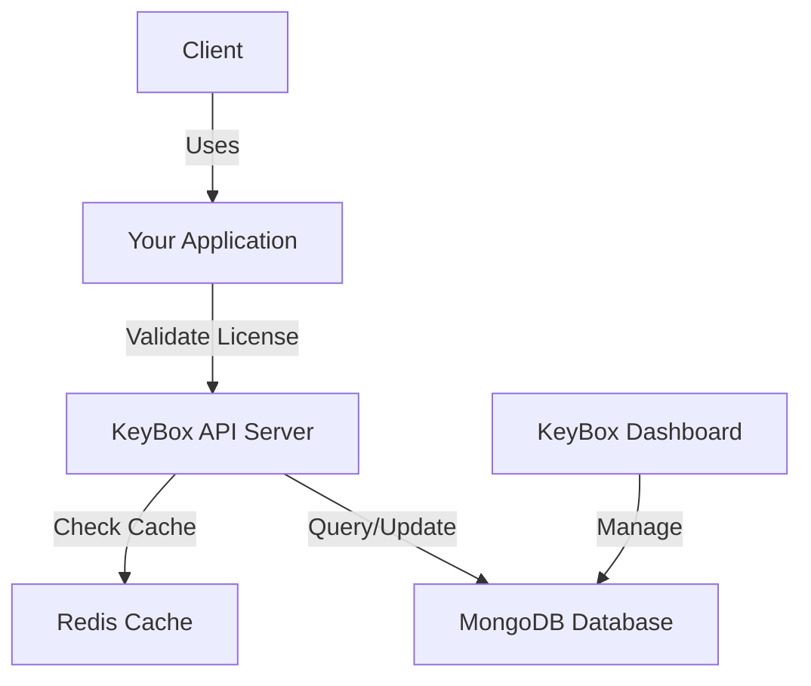

## What is KeyBox?

KeyBox is a self-hosted license key management platform that helps you generate, validate, and revoke access to your software applications. It provides a complete solution for protecting your software with machine-bound licenses, real-time validation, and automated lifecycle management.

<Info>
  KeyBox is open-source and built with modern technologies including Node.js, Next.js, MongoDB, and Redis for optimal performance and scalability.
</Info>

## Why Use KeyBox?

KeyBox solves the complex challenge of software licensing by providing:

<CardGroup cols={2}>
  <Card title="Secure License Generation" icon="key">
    Generate cryptographically secure license keys tied to your projects and clients
  </Card>
  <Card title="Real-time Validation" icon="bolt">
    Validate licenses in milliseconds with Redis caching layer
  </Card>
  <Card title="Machine Binding" icon="fingerprint">
    Lock licenses to specific machines to prevent unauthorized sharing
  </Card>
  <Card title="Automated Management" icon="robot">
    Background daemons handle validation, expiration, and revocation automatically
  </Card>
</CardGroup>

### Perfect For

- **SaaS Platforms** - Control access with time-based subscriptions
- **Desktop Applications** - Protect software with machine-locked licenses
- **API Services** - Manage access to your APIs and microservices
- **Enterprise Software** - Deploy licensed software to corporate clients
- **Developer Tools** - Monetize CLI tools and development frameworks

## Key Features

### License Management

KeyBox provides comprehensive license lifecycle management:

- **Generate** unique license keys with configurable durations (1-12 months)
- **Activate** licenses on first use with machine binding
- **Validate** licenses with automatic status checks every 15 minutes
- **Revoke** licenses instantly when needed
- **Expire** licenses automatically based on configured duration

### License States

Every license in KeyBox has one of four states:

| State | Description |
|-------|-------------|
| `PENDING` | License created but not yet activated |
| `ACTIVE` | License activated and currently valid |
| `EXPIRED` | License duration has ended |
| `REVOKED` | License manually revoked by admin |

### Multi-Language SDK Support

Integrate KeyBox into your application with official SDKs:

<CodeGroup>

```javascript Node.js
import { protectNodeApp } from "keybox-sdk"

await protectNodeApp({
  app,
  port: 3000,
  productName: "MyApp",
  key: process.env.LICENSE_KEY
})
```

```python Python
from keybox_sdk import protect_fastapi_app

protect_fastapi_app(
    app=app,
    product_name="MyApp",
    key="YOUR_LICENSE_KEY"
)
```

```csharp .NET
using KeyboxSdk;

await app.RunProtectedAsync(
    productName: "MyApp",
    key: "YOUR_LICENSE_KEY"
);
```

</CodeGroup>

### Background Validation Daemon

All SDKs include a background validation daemon that:

- Validates the license on application startup
- Re-validates every **15 minutes** automatically
- Gracefully shuts down your app if license becomes invalid
- Handles network errors without disrupting operation

<Warning>
  If a license is revoked or expires, the background daemon will automatically shut down your application to prevent unauthorized use.
</Warning>

## Architecture Overview

KeyBox consists of three main components:



### Components

<Steps>
  <Step title="Backend API">
    Node.js/Express server that handles:
    - License generation and validation
    - Client and project management
    - Authentication with JWT and OAuth
    - Redis caching for fast validation
    
    **Location:** `apps/server/`
  </Step>
  
  <Step title="Frontend Dashboard">
    Next.js web application for:
    - Managing clients and projects
    - Creating and monitoring licenses
    - Viewing usage analytics
    - Accessing API documentation
    
    **Location:** `apps/web/`
  </Step>
  
  <Step title="SDKs">
    Official SDKs for integrating KeyBox into your applications:
    - **Node.js SDK** - For Express and Node.js apps
    - **Python SDK** - For FastAPI and Python apps
    - **.NET SDK** - For ASP.NET Core apps
    
    **Location:** `apps/SDK/`
  </Step>
</Steps>

## How It Works

<Steps>
  <Step title="Create a Client">
    Register your customer in the KeyBox dashboard with their name and email
  </Step>
  
  <Step title="Create a Project">
    Add a project for the client (e.g., "MyApp Pro", "Enterprise Edition")
  </Step>
  
  <Step title="Generate License">
    Create a license key with:
    - Duration (1-12 months)
    - Services included
    - Project association
    
    The license starts in `PENDING` state
  </Step>
  
  <Step title="Integrate SDK">
    Add the KeyBox SDK to your application and pass the license key
  </Step>
  
  <Step title="Activate on First Run">
    When the app starts, the SDK:
    - Activates the license (changes state to `ACTIVE`)
    - Binds it to the machine ID
    - Starts the background validation daemon
  </Step>
  
  <Step title="Continuous Validation">
    The daemon validates the license every 15 minutes:
    - Checks if still `ACTIVE`
    - Verifies not expired
    - Confirms not revoked
    - Shuts down app if invalid
  </Step>
</Steps>

## Data Models

### License Schema

```typescript
interface License {
  key: string              // Unique license key
  duration: number         // Duration in months (1-12)
  issuedAt: Date          // Activation timestamp
  expiresAt: Date         // Expiration timestamp
  status: Status          // PENDING | ACTIVE | EXPIRED | REVOKED
  services: string[]      // Included services
  machineId: string       // Bound machine identifier
  user: ObjectId          // License owner
  client: ObjectId        // Associated client
  project: ObjectId       // Associated project
}
```

### Client Schema

```typescript
interface Client {
  name: string            // Client name
  email: string           // Client email
  owner: ObjectId         // User who created this client
  createdAt: Date        // Creation timestamp
}
```

### Project Schema

```typescript
interface Project {
  name: string            // Project name
  client: ObjectId        // Associated client
  createdAt: Date        // Creation timestamp
}
```

## API Endpoints

KeyBox provides RESTful API endpoints for all operations:

| Endpoint | Method | Description |
|----------|--------|-------------|
| `/validate` | POST | Validate a license key |
| `/validate/activate` | POST | Activate a pending license |
| `/license/create` | POST | Create a new license |
| `/license/toggle/:key` | PATCH | Toggle license status (active/revoked) |
| `/client` | GET/POST | Manage clients |
| `/project` | GET/POST | Manage projects |

<Info>
  See the [API Reference](/api/overview) for detailed endpoint documentation.
</Info>

## Security Features

<CardGroup cols={2}>
  <Card title="Machine Binding" icon="lock">
    Licenses are bound to unique machine IDs to prevent sharing across devices
  </Card>
  <Card title="JWT Authentication" icon="shield">
    All API requests require valid JWT tokens for authentication
  </Card>
  <Card title="Redis Caching" icon="bolt">
    Validated licenses are cached to prevent database overload and ensure fast response times
  </Card>
  <Card title="Rate Limiting" icon="gauge">
    API endpoints are rate-limited to prevent abuse
  </Card>
</CardGroup>

## Performance

- **Validation Speed**: < 10ms (with Redis cache)
- **Cache Duration**: Configurable TTL
- **Background Checks**: Every 15 minutes
- **Database**: MongoDB with indexed queries

## Tech Stack

**Backend:**
- Node.js 18+
- Express.js
- TypeScript
- MongoDB (Mongoose)
- Redis
- JWT Authentication

**Frontend:**
- Next.js 14
- React
- TypeScript
- Tailwind CSS

**SDKs:**
- Node.js (CommonJS)
- Python 3.10+
- .NET 8.0+

## What's Next?

<CardGroup cols={2}>
  <Card title="Quick Start Guide" icon="rocket" href="/quickstart">
    Get KeyBox up and running in 5 minutes
  </Card>
  <Card title="How It Works" icon="book" href="/concepts/how-it-works">
    Dive deeper into KeyBox architecture
  </Card>
  <Card title="SDK Integration" icon="code" href="/sdks/overview">
    Learn how to integrate KeyBox into your app
  </Card>
  <Card title="Deploy KeyBox" icon="server" href="/deployment/backend-setup">
    Self-host KeyBox on your infrastructure
  </Card>
</CardGroup>
